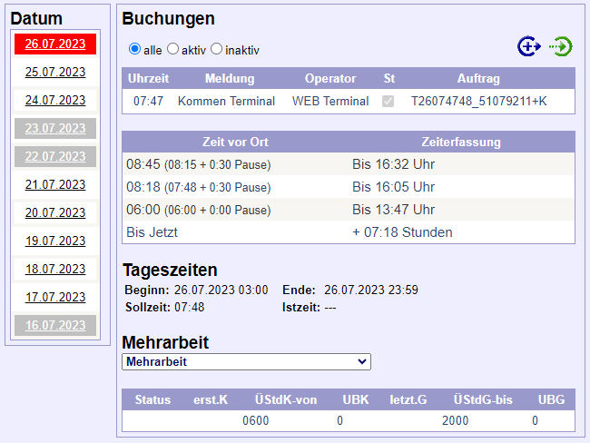

# RPTU TsWeb-Extension
## Lizenz
 Dieses Werk ist lizenziert unter einer <a rel="license" href="http://creativecommons.org/licenses/by-nc-sa/4.0/">Creative Commons Namensnennung - Nicht-kommerziell - Weitergabe unter gleichen Bedingungen 4.0 International Lizenz</a>.

## Allgemein
Fügt auf der Website der RPTU-Zeiterfassung eine automatische Berechnung folgender üblichen Arbeitszeiten hinzu.
- 08:45 Stunden (= 08:15 + 0:30 Pause)
- 08:18 Stunden (= 07:48 + 0:30 Pause)
- 06:00 Stunden (= 06:00 + 0:00 Pause)
- Bis jetzt (Automatische Pausenrechnung)

## Aussehen:

## Entwicklung
Der Quellcode ist auf GitHub hinterlegt: https://github.com/JanHeist/RPTU_TsWeb-Extension

Entwickler einblenden

- Jan Heist
  - GitHub: JanHeist
  - E-Mail: rptu-extension@janheist.dev
  - Web: https://JanHeist.dev

